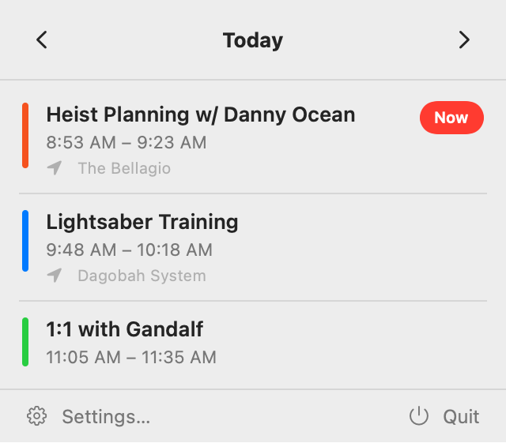
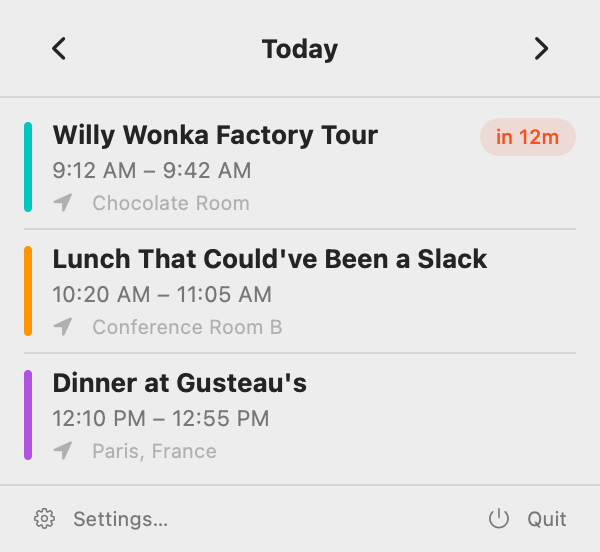

# UpNext

[](https://github.com/srichand/UpNext/actions/workflows/objective-c-xcode.yml)
[](https://github.com/srichand/UpNext/actions/workflows/swift.yml)

Your next meeting, always one glance away. UpNext lives in your macOS menu bar and tells you what's coming up so you're never blindsided by a calendar invite again.

<p align="center">
  
  &nbsp;&nbsp;
  
</p>

## Features

- **Menu bar countdown** — see your next event and a live relative timer (`in 12m`, `in 1h 5m`, or `now`)
- **Day navigation** — browse past and future days with quick prev/next controls
- **Calendar filtering** — pick which calendars to monitor in Settings
- **Launch at Login** — start automatically so you never miss a beat
- **Zero dependencies** — pure SwiftUI + EventKit, no third-party libraries

## Requirements

- macOS 14.0+
- Xcode 16+

## Build and Run

```bash
xcodebuild -project UpNext.xcodeproj -scheme UpNext -configuration Debug -derivedDataPath /tmp/UpNextDerived build
open /tmp/UpNextDerived/Build/Products/Debug/UpNext.app
```

Or open the project in Xcode:

```bash
open UpNext.xcodeproj
```

## Testing

Run the full app and UI-facing test suite with Xcode:

```bash
xcodebuild -project UpNext.xcodeproj -scheme UpNext -configuration Debug -derivedDataPath /tmp/UpNextDerived test
```

Run the shared `UpNextCore` package tests with SwiftPM:

```bash
swift test --scratch-path /tmp/UpNextSwiftPM
```

## Automated Screenshots

Generate deterministic SwiftUI screenshots (seeded data, no Calendar permission prompts):

```bash
./scripts/capture-screenshots.sh
```

Optional output directory:

```bash
./scripts/capture-screenshots.sh /tmp/UpNextScreenshots
```

## Permissions

UpNext requests Calendar access to read your events and show upcoming meetings.

## License

MIT. See [LICENSE](LICENSE).
